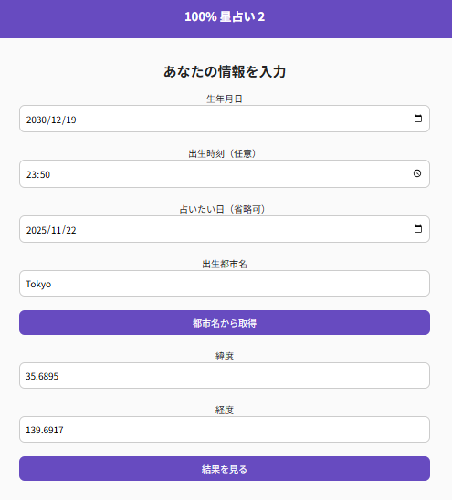
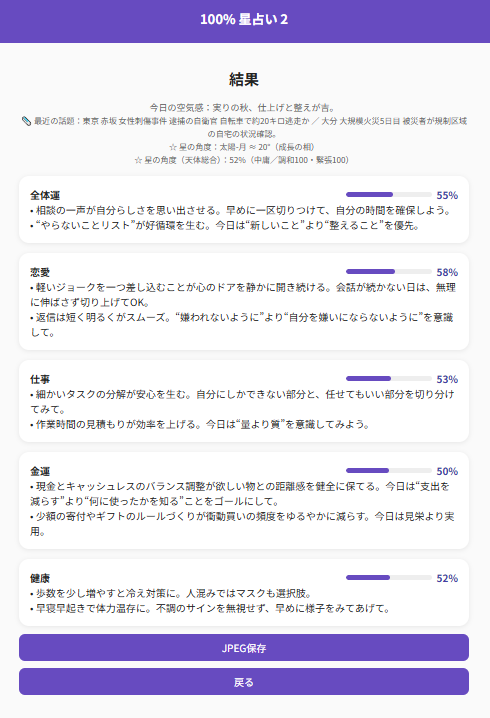

# 🌟 100% 星占い 2

<p align="center">
  
</p>

**100% 星占い 2** は、初代「100% 星占い」をベースに、  
**太陽・月 + 水星〜土星までをまとめて角度解析**する「ハードコア角度モード専用」版です。

クラシックな占星術のアスペクト（0° / 60° / 90° / 120° / 180° など）をもとに、  
**全体運・恋愛・仕事・金運・健康** を「100% スコア」と短いアドバイスで表示します。

---

## 🚀 実行ページ

👉 **https://masato-nasu.github.io/horoscope-100pct-2/**

> スマートフォンでアクセスすると、ホーム画面に追加してアプリのように使えます（PWA）。

---

## 📸 スクリーンショット

**入力画面**

<p align="center">
  
</p>

**結果画面**

<p align="center">
  
</p>

---

## 🔮 特長（2版のポイント）

- **ハードコア角度モード専用**
  - 太陽・月だけでなく、**水星・金星・火星・木星・土星** までをまとめて評価
  - 0°（コンジャンクション）、60°（セクスタイル）、90°（スクエア）、120°（トライン）、180°（オポジション）など  
    代表的なアスペクトを重み付きでスコア化

- **2本立ての「星の角度」表示**
  - `☆ 星の角度：太陽-月 ≈ XX°（新月／満月／成長の相…）`
  - `☆ 星の角度（天体総合）：YY%（中庸／調和◯◯・緊張◯◯）`
  - 「一般的な太陽‐月の運勢」と、「多天体の総合状態」が並んで分かります。

- **100% スコアバー**
  - 全体運・恋愛・仕事・金運・健康を **0–100% のバー + 2行のアドバイス** で表示

- **文章テンプレート母数を大幅拡張**
  - 各ジャンルごとに **a / b / c パーツをそれぞれ約45パターン** 用意
  - a（出だし） / b（中盤） / c（締め） + キーワード重複率で  
    **「同じフレーズが続けて出ない」ように制御**

- **任意日も占える**
  - 今日だけでなく、誕生日・任意日を指定して「その日の空気感」を再現可能

- **オフラインでも軽快**
  - PWA + キャッシュで、ホーム画面からサクッと起動

---

## 🧭 Meeus 暦算 + 多天体角度エンジン

### 太陽・月（Meeus 法）

天体計算は、ベルギーの天文学者 **Jean Meeus（ジャン・ミュース）** による  
『*Astronomical Algorithms*』（1998, Willmann–Bell刊）をベースにした **Meeus 法** を使用しています。

- 太陽・月の黄経を **±0.5° 程度** の誤差で算出
- ブラウザのみで完結しつつ、観測値とほぼ一致する水準の精度

### 水星〜土星の近似位置

水星・金星・火星・木星・土星については、  
公開されている軌道要素に基づいた **軽量な近似モデル** で黄経を求めています。

- 目的は「占い用の**角度関係**の再現」であり、  
  天文学的な厳密さより **相対的な位置関係の一貫性** を重視しています。

---

## ⚙️ アルゴリズム概要（100% 星占い 2）

1. **天体位置の計算**
   - 解析日の正午（＋入力された出生時刻の補正）で  
     **太陽・月・水星・金星・火星・木星・土星** の黄経（0–360°）を取得

2. **全ペアの角度とアスペクト評価**
   - 7天体の全組み合わせについて角度差（0–180°）を計算
   - 代表的なアスペクト（0, 30, 36, 45, 60, 72, 90, 108, 120, 135, 144, 150, 180°）の近傍をチェック  
   - それぞれに「orb（許容誤差）」と「impact（プラス／マイナス寄与）」を設定

3. **ハーモニー／テンションの集計**
   - すべてのペアの寄与を集約し、
     - `score`：全体のバランスを 0–100% に正規化した値
     - `harmonyScore`：調和的なアスペクトの強さ（0–100）
     - `tensionScore`：緊張的なアスペクトの強さ（0–100）
     - `globalPower`：全体の「吉凶傾向」を表す内部指標  
     を算出します。

4. **カテゴリ別スコア化**
   - 上記 `score` をベースに、  
     分野ごとの性質（恋愛・仕事・金運・健康）に応じて微調整
   - 日付・誕生日・出生時刻などから安定乱数を生成し、  
     **±数%のゆらぎ** を加えて「その日ならでは」の数値に

5. **文章生成（被り回避つき）**
   - 各ジャンルごとに  
     a（出だし） / b（中盤） / c（締め） のテンプレを用意
   - 1本目・2本目の文で、
     - a / b / c それぞれが被らない  
     - 文全体が同一にならない  
     - 日本語キーワードの重複率が一定以下  
     になるように制御し、**毎日読んでも単調になりにくい** 構成にしています。

---

## 📰 ニュース & 季節感

- ニュース：**GNews API**（失敗時は **NHKニュースのRSS** にフォールバック）
- 解析日の **季節トーン（一言の季節感）** を付与
- そのうえで、下記のように 2本の角度行を追加表示します：

```text
☆ 星の角度：太陽-月 ≈ XX°（成長の相 など）
☆ 星の角度（天体総合）：YY%（中庸／調和◯◯・緊張◯◯）
🖼 結果の保存（JPEG）
「JPEG保存」ボタンで、結果画面をそのまま画像として保存できます。

ファイル名の例：
horoscope_YYYYMMDD_HHMM[_任意日]_誕生日_出生時刻.jpg

📲 インストール方法（PWA）
このアプリは PWA（Progressive Web App）対応です。
ブラウザからホーム画面に追加すると、ストアアプリのように使えます。
一度追加すれば オフラインでも起動 できます。

✅ Android（Chrome）
アプリページを Chrome で開く

右上メニュー「︙」 → ［アプリをインストール］ を選択

案内に従ってホーム画面に追加

ホーム画面に「100% 星占い 2」アイコンが追加されます。
以後はアイコンから直接起動（全画面・アドレスバーなし）。

✅ iPhone / iPad（Safari）
アプリページを Safari で開く

画面下の共有ボタン「□↑」をタップ

下にスクロールして ［ホーム画面に追加］ を選択

右上の「追加」を押すと、ホームにアイコンが並びます

💡 iOS版では、初回起動時にスプラッシュ画面が表示されます。
